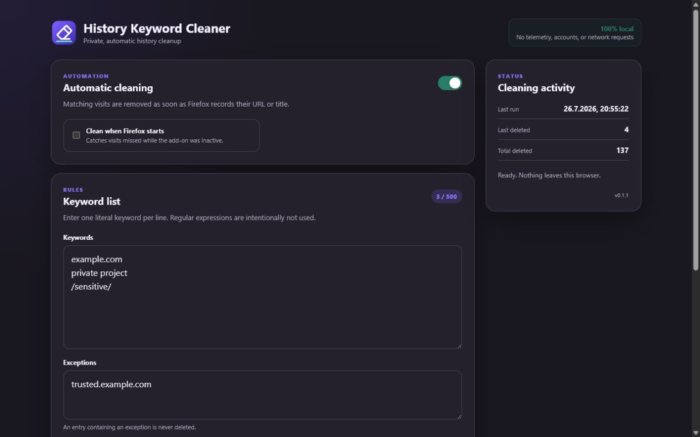
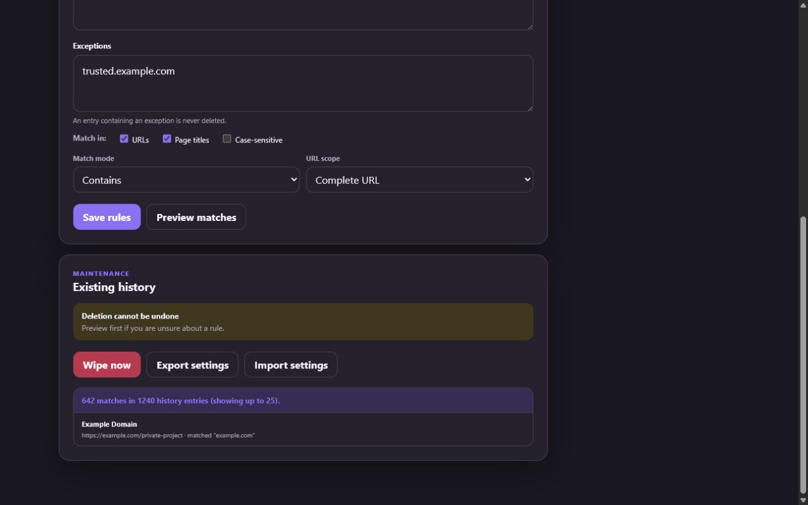
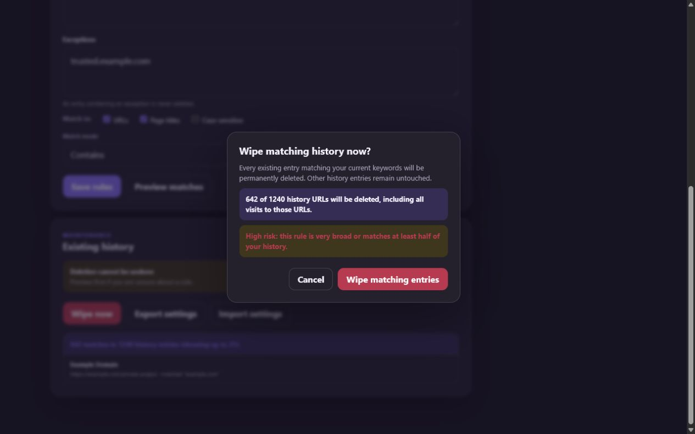
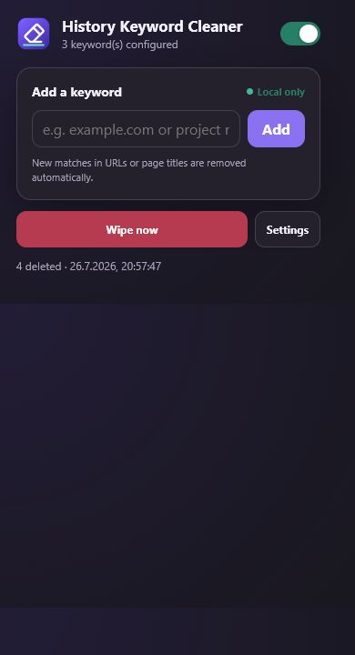

# History Keyword Cleaner

[](https://addons.mozilla.org/de/firefox/addon/history-keyword-sanitizer/)
[](https://github.com/cpfaffinger/Firefox-History-Keyword-Cleaner/actions/workflows/ci.yml)
[](#quality)
[](LICENSE)

Safe, local history rules for Firefox.

History Keyword Cleaner automatically removes Firefox history URLs whose URL
or page title matches a locally defined keyword. It never transmits keywords or
browsing activity.

## Safety model

- Saving, importing, enabling, or disabling rules never scans or changes
  existing history.
- **Wipe now** always performs a fresh preview before asking for confirmation.
- The confirmation shows the exact number of matching URLs, the number checked,
  and a low, medium, or high risk indication.
- Broad rules require an additional confirmation before they can be saved.
- Exceptions protect matching URLs from deletion.
- Long operations are asynchronous, report their phase and progress, and can be
  cancelled cooperatively.
- Startup cleanup is disabled by default and must be explicitly enabled.

Firefox's `history.deleteUrl()` removes every recorded visit to a matching URL.
The confirmation states this explicitly. Deletion cannot be undone.

## Features

- Match URLs, page titles, or both.
- Match by substring, whole Unicode word, or exact value.
- Limit URL matching to the complete URL, domain, or path and query.
- Optional case-sensitive matching and local exception rules.
- Match percent-encoded URL text where it can be decoded safely.
- Automatic cleaning for new visits and title updates.
- Optional startup cleanup and a manual **Wipe now** flow.
- Settings import and export as JSON.
- Privacy-safe diagnostic log export for support requests.
- English by default, plus German, French, Italian, Dutch, and Turkish.
- No telemetry, account, advertising, network request, host permission, or
  content script.

Keywords, settings, operation state, and aggregate deletion counters remain in
the local Firefox profile. The add-on deliberately does not use
`storage.sync`.

## Screenshots









These are captures of the real add-on UI driven by the local preview harness;
they contain deterministic sample data and no real browsing history.

## Install

[Install History Keyword Cleaner from Firefox Add-ons](https://addons.mozilla.org/de/firefox/addon/history-keyword-sanitizer/).

The manifest supports Firefox Desktop 140+ and Firefox for Android 142+. Firefox
for Android currently omits the WebExtensions `history` API. The Android UI
therefore remains available for rule management and diagnostic export, but
selective history preview, automatic cleaning, and deletion are disabled with
a precise explanation. The capability check will enable these operations
automatically if Firefox exposes the API in a future release.

## Permissions and privacy

The extension requests only:

- `history`, to inspect and delete matching history URLs and receive visit/title
  events;
- `storage`, to retain local rules, operation state, aggregate counters, and a
  bounded diagnostic event log.

The diagnostic export omits rule text, exceptions, URLs, and page titles.

The manifest declares Mozilla's data-collection permission as
`required: ["none"]`. See [PRIVACY.md](PRIVACY.md) and
[SECURITY.md](SECURITY.md).

## Local development

Requirements: Node.js 22+, pnpm, and Firefox.

```powershell
pnpm install
pnpm dev:local
```

The Windows command uses `C:\Program Files\Mozilla Firefox\firefox.exe`.
`pnpm dev` uses the Firefox executable discovered by `web-ext`.

Firefox starts with a temporary profile. Alternatively, open
`about:debugging`, choose **This Firefox**, select **Load Temporary Add-on**,
and open `src/manifest.json`.

## Quality

```sh
pnpm verify
pnpm screenshots:amo
```

The verification chain enforces 100% line coverage across every JavaScript file
shipped in `src/`, runs project safety checks, treats all `web-ext` and
`addons-linter` warnings as errors, builds the ZIP, and validates the exact
package. Tests cover rules, history scanning, cancellation, orchestration,
background recovery, and both user interfaces.

The weekly compatibility workflow loads the extension in Firefox 140 and the
latest stable Firefox. Responsive and Android-focused manual checks are listed
in [docs/MANUAL_TESTS.md](docs/MANUAL_TESTS.md).

## Releases and versions

Every successful commit or merge to `main` receives a monotonically increasing
CI-only version `0.1.<GitHub run number>`. The verified ZIP is attached to a
non-prerelease GitHub release named `main-<short SHA>` and retained as a workflow
artifact for 90 days.

Version tags are authoritative. Pushing `v0.3.0`, for example, builds a binary
with manifest version `0.3.0` even when the source branch still contains the
development version:

```sh
git tag v0.3.0
git push origin v0.3.0
```

AMO submission is intentionally separated from ordinary builds. A maintainer
starts **Submit a tagged release to AMO**, selects a version tag, and approves
the protected `amo-production` environment. See
[docs/AMO_RELEASE.md](docs/AMO_RELEASE.md).

## Project structure

```text
src/      Human-readable files shipped to Firefox
tests/    Unit, integration, UI, manifest, locale, and policy tests
amo/      Product-page metadata, screenshots, and reviewer notes
docs/     Release, product, and manual-test documentation
tools/    Validation and CI version helpers
```

There is no transpilation, minification, obfuscation, or remotely loaded
runtime dependency.

## Support and security

Report normal defects through
[GitHub Issues](https://github.com/cpfaffinger/Firefox-History-Keyword-Cleaner/issues).
Report vulnerabilities privately through
[GitHub Security Advisories](https://github.com/cpfaffinger/Firefox-History-Keyword-Cleaner/security/advisories/new).
Do not include private URLs, keywords, or browsing records in a public issue.

## Documentation language

Repository documentation, policies, release notes, AMO copy, and reviewer
instructions are maintained exclusively in English. Product-interface
translations belong in `src/_locales/`.

## License and icon

History Keyword Cleaner is available under the [MIT License](LICENSE). The
eraser glyph is adapted from [Tabler Icons](https://github.com/tabler/tabler-icons);
the packaged notice is in [src/icons/LICENSE.md](src/icons/LICENSE.md).
